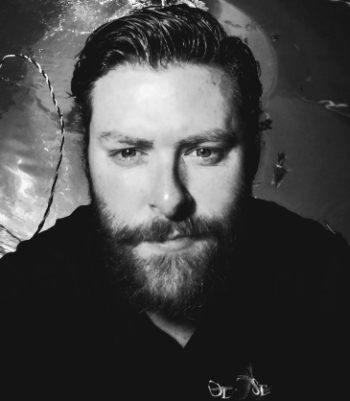

# A little insight into Ryne Smith
Hello, there. I am Ryne Smith and I am currently an associate fleet technician for the autonomous driving company, Waymo. This README serves as a way for me to provide a bit more information about myself.

## My Career Passions
My favorite feeling in the world ar those "Eureka!" and "Aha!" moments. I live for those! I strive to work in environments that provide ample ooportunities pursue them. I particularly enjoy taking on a complex project and finding ways to break it down into manageable components that myself and others can work together on. As well as looking for connections between them and other totally different subject areas, especially areas and applications no one else has thought to look. I have also gone back to into the world of academia to finish my bachelor's degree in Mathematics.

## My Hobbies
I have a background in scuba diving (I used to dive with sharks on a daily basis) and I love working in and around the water. However, if there is one environmentwhere I feel most at home it is the mountains. It has been many years (and a broken wrist), but I am aching to go skiing or snowboarding again. There is nothing more beatiful than a forest with snow and ice. You can also find me home (especially in the garage) coding for a personal project, or curled up on the cound reading a book. 

## My Favorite Books :books:
For most of my life, I have overwhelmingly read non-fiction books. These were invariably about whatever subject fascinated me at the time. This is still tru today, but now I try to take more breaks from reality and enjoy great fiction. The first fiction book that I remember choosing to read was "Ender's Game." I saw a poster for it in my middle school library and I ended up feeling such a connection with the main character. So, what kind of fiction do I read now? I have begin reading "The Chronicles of Narnia" series and falling in love with the *scenery* and magic of it all. 
